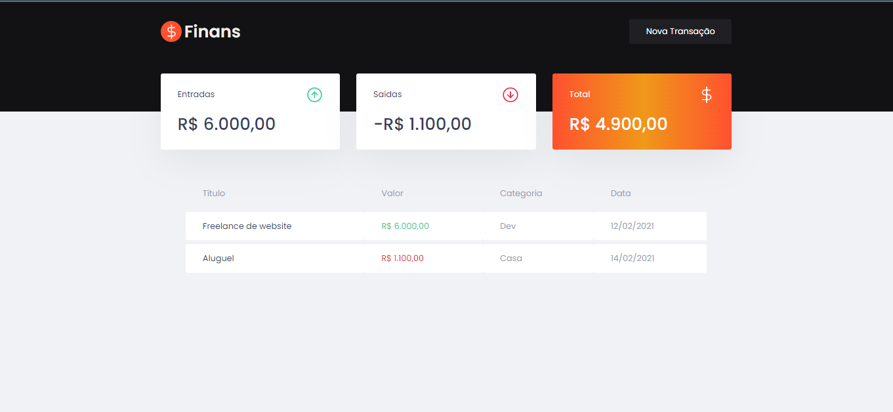
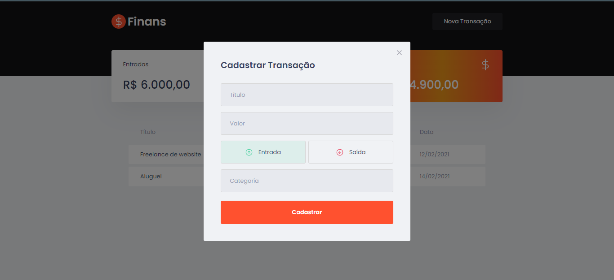
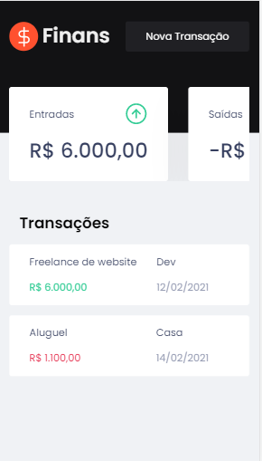
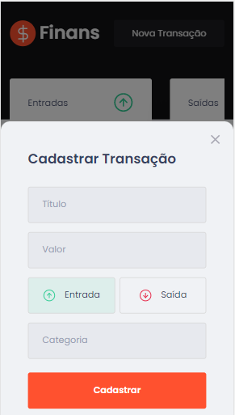

# Finans

## Tópicos

- Sobre o Finans

- Tecnologias

- Instalação e uso

- Licença

## Sobre o Finans
- O Finans é uma alternativa simples e eficaz para gerenciar suas finanças, permitindo o cadastro de entradas, saídas e a organização das mesmas em categorias.

## Desktop

 

## Mobile

    -----------              

## Tecnologias e ferramentas utilizadas no desenvolvimento do projeto:

- React

- TypeScript

- Styled Components

- MirageJS

- Axios

- Polished

Instalação e uso
# Abra um terminal e copie este repositório com o comando
git clone https://github.com/fernandesguilherme07/finans.git
# ou use a opção de download.

# Entre na pasta web com
cd dtmoney

# Instale as dependências
yarn install

# Rode a aplicação
yarn start

Licença
License
Esse projeto está sob a licença MIT. Veja o arquivo LICENSE para mais detalhes.

Feito com 🧡 by Guilherme Fernandes

